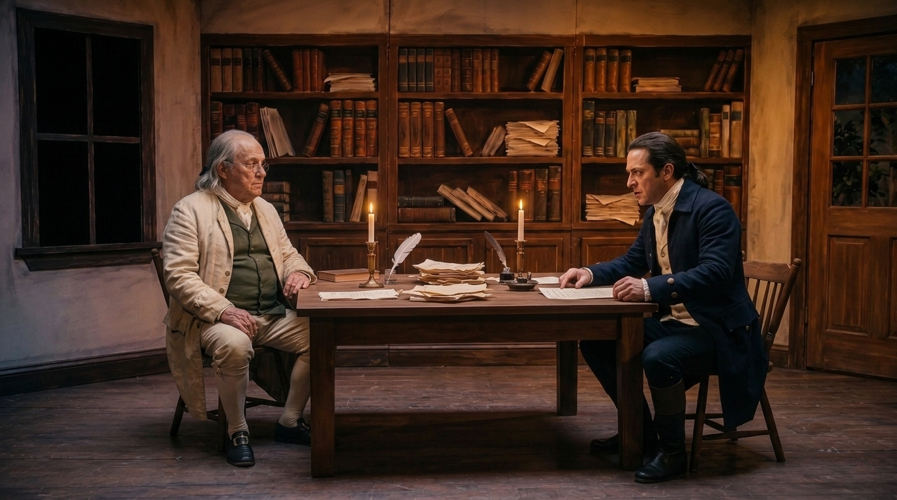

# Claude Handoff: Self Evident Project State Site

This document is for Claude Code or any other agent maintaining the public
project-state website for *Self Evident*. This file lives in the repo it
describes (`~/Documents/SelfEvidentProjectState`) so Claude Code loads it
automatically when working here.

## Role Split

Codex remains the working environment for developing the film itself: writing,
promptwriting, shot planning, render attempts, clip review, and production
decisions.

Claude is responsible for updating the public documentation site that explains
the current state of the project to friends/collaborators. Treat the site as a
readable project room, not as the production source of truth.

## Site Location

This repository **is** the maintained GitHub Pages site:

```text
~/Documents/SelfEvidentProjectState
```

Important files:

```text
index.html
styles.css
.nojekyll
self-evident/storyboard/scene-01-storyboard-panels.html
self-evident/storyboard/scene-01-storyboard-panels/index.html
self-evident/keyframes/
self-evident/refs/
self-evident/audio/voice-tests/
```

The original conversion happened in this Codex/Sites workspace:

```text
/Users/lancebarker/Documents/Codex/2026-07-10/sites-plugin-sites-openai-bundled-create
```

That workspace contains a `docs/` copy of the static bundle, but it is no
longer the primary site-maintenance location. Routine documentation updates
should happen in `~/Documents/SelfEvidentProjectState`, then be committed and
pushed to GitHub from there.

## Film Source Of Truth

The film development files live primarily under:

```text
/Users/lancebarker/Documents/Promptwriting/SelfEvident
```

Useful subfolders:

```text
notes/
notes/Log/
references/concept-art/
script/
scene-01-the-committee/
scene-01-the-committee/clips/approved/
scene-01-the-committee/clips/pilots/
scene-01-the-committee/clips/rejected/
scene-01-the-committee/manifests/
scene-01-the-committee/stills/keyframes/
scene-02-the-garden/
scene-02-the-garden/clips/approved/
scene-02-the-garden/clips/pilots/
scene-02-the-garden/clips/rejected/
scene-02-the-garden/manifests/
scene-02-the-garden/stills/keyframes/
tests/elevenlabs/
tests/veo/
workflow/incoming/
```

When updating the site, read recent notes/manifests and compare against approved
clips and accepted keyframes. Do not infer production status from filenames
alone if a note or manifest gives a clearer decision.

## What The Site Currently Contains

The static site preserves the last working Sites version and adds back the
storyboard page. It includes:

- About hero explaining the project for friends/collaborators.
- Current Focus section immediately after About.
- Next visible actions.
- Production state metrics.
- Recent work, currently focused on July 10 and July 12 progress.
- Storyboard callout and menu item.
- Scene 01 shot-state cards.
- Voice Lab with four ElevenLabs audio players.
- Scene 01 / Scene 02 overview.
- Decisions locked.
- Full Scene 01 storyboard panels, SH01-SH10.

The restored storyboard can be reached through:

```text
self-evident/storyboard/scene-01-storyboard-panels/index.html
```

and the older `.html` form remains available:

```text
self-evident/storyboard/scene-01-storyboard-panels.html
```

Keep both unless there is a good reason to remove one.

## Updating The Site

For routine updates:

1. Read recent film progress in `/Users/lancebarker/Documents/Promptwriting/SelfEvident`.
2. Identify only viewer-relevant changes: accepted clips, rejected approaches
   that changed the plan, new voice tests, new keyframes, workflow decisions,
   or changed next actions.
3. Update `~/Documents/SelfEvidentProjectState/index.html`.
4. Add or replace assets under `~/Documents/SelfEvidentProjectState/self-evident/...`.
5. Keep asset links relative, not root-relative. Good:

```html

```

Bad:

```html

```

6. If the storyboard is updated, update both:

```text
self-evident/storyboard/scene-01-storyboard-panels.html
self-evident/storyboard/scene-01-storyboard-panels/index.html
```

7. Verify local links before committing.
8. Commit and push to GitHub.

## Link Check Snippet

Run this from the repository root after edits:

```bash
node - <<'NODE'
const fs = require('fs');
const path = require('path');
const files = [
  'index.html',
  'self-evident/storyboard/scene-01-storyboard-panels.html',
  'self-evident/storyboard/scene-01-storyboard-panels/index.html'
];
let missing = [];
for (const file of files) {
  const html = fs.readFileSync(file, 'utf8');
  const dir = path.dirname(file);
  const re = /(?:src|href)="([^"]+)"/g;
  for (const m of html.matchAll(re)) {
    const ref = m[1];
    if (/^(https?:|#|mailto:)/.test(ref)) continue;
    const target = path.normalize(path.join(dir, ref));
    if (!fs.existsSync(target)) missing.push(`${file} -> ${ref} (${target})`);
  }
}
if (missing.length) {
  console.log('Missing refs:');
  for (const item of missing) console.log(item);
  process.exit(1);
}
console.log('All local refs exist');
NODE
```

## Design Notes

The site is intentionally static and plain:

- `index.html` contains the content.
- `styles.css` contains the layout and visual system.
- No build step is required.
- No framework runtime is required.
- This avoids the prior Sites publishing problems.

The style direction is restrained theatrical/production-room:

- warm paper background;
- dark green and ink accents;
- compact metrics and production cards;
- large first-viewport About hero;
- practical sections for progress rather than marketing copy.

Avoid turning it into a generic landing page. The value is context, current
state, and decision history.

## Background: How This Site Was Created

The first version was built as an OpenAI Sites/Vinext app with:

```text
app/page.tsx
app/globals.css
app/layout.tsx
public/self-evident/...
```

Publishing through Sites repeatedly hit a sandbox DNS failure when pushing to:

```text
git.chatgpt-team.site
```

The site was then converted into a static GitHub Pages bundle. Lance copied
that bundle into its own local GitHub repository at
`~/Documents/SelfEvidentProjectState` and pushed it to GitHub
(`github.com/lancefb/SelfEvidentProjectState`, served at
`http://lancebarker.me/SelfEvidentProjectState/`). That standalone repo is the
maintained public version going forward. The old Sites app files and the
conversion workspace can remain for reference, but routine public updates
should happen in `~/Documents/SelfEvidentProjectState`.

## Do Not

- Do not edit film production files unless Lance explicitly asks.
- Do not treat the website as the authoritative project database.
- Do not delete the restored storyboard alias files.
- Do not use root-relative asset URLs in the GitHub Pages repo.
- Do not reintroduce the Sites deployment workflow for routine updates.

## Good Update Criteria

A good update should answer:

- What materially changed since the last public snapshot?
- What is now accepted, rejected, or still uncertain?
- What should a friend/collaborator understand without reading production notes?
- Are the next actions still accurate?
- Do the audio/image/storyboard links still work on GitHub Pages?
